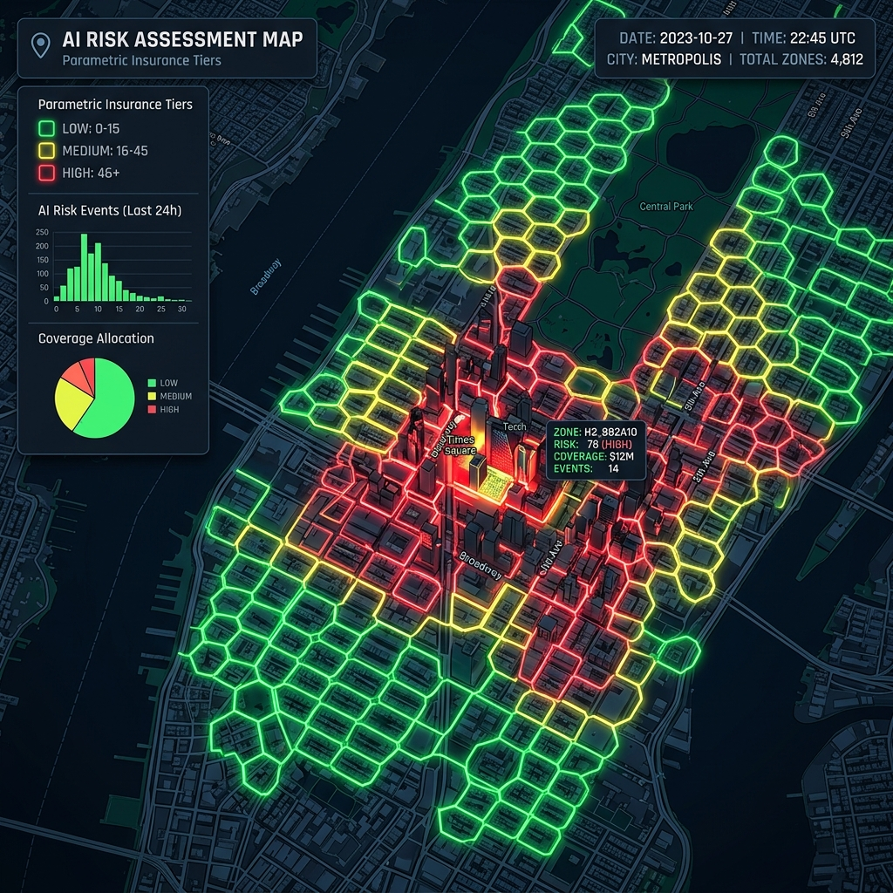
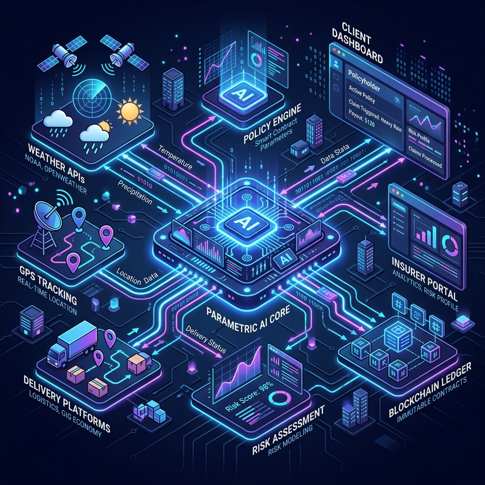
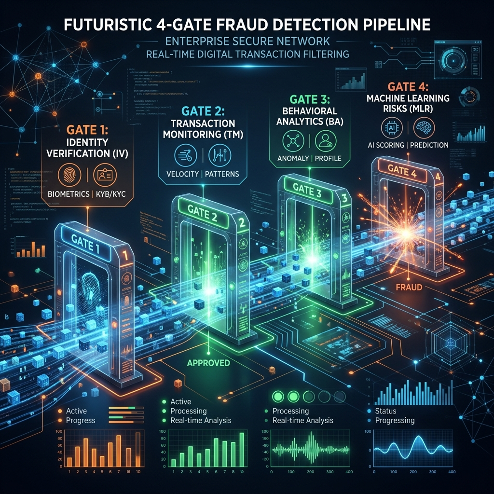

<div align="center">

# 🛡️ DevTrails — Parametric Income Protection for Gig Delivery Workers

**A weekly, automated micro-insurance product that pays gig workers within 10 minutes when external disruptions kill their earnings — no paperwork, no claims, no delays.**

<br /><br />

[](https://nextjs.org/)
[](https://go.dev/)
[](https://python.org/)
[](https://www.postgresql.org/)
[](https://kafka.apache.org/)
[](LICENSE)

</div>

---

## 📑 Table of Contents

1. [Problem Statement](#-problem-statement)
2. [Our Solution](#-our-solution)
3. [Persona-Based Scenarios](#-persona-based-scenarios)
4. [Application Workflow](#-application-workflow)
5. [Weekly Premium Model](#-weekly-premium-model)
6. [Parametric Triggers & Data Sources](#-parametric-triggers--data-sources)
7. [Payout Calculation Mechanics](#-payout-calculation-mechanics)
8. [Financial Sustainability](#-financial-sustainability)
9. [AI/ML Integration](#-aiml-integration)
10. [System Architecture](#-system-architecture)
11. [Tech Stack](#-tech-stack)
12. [Platform Justification — Why a PWA?](#-platform-justification--why-a-pwa)
13. [Development Plan](#-development-plan)
14. [Documentation](#-documentation)
15. [Getting Started](#-getting-started)

---

## 🔍 Problem Statement

India's gig economy employs over **7.7 million platform-based delivery workers**. These riders earn between ₹300–₹800 per day, with zero employer-provided safety nets. When external disruptions hit — a sudden cloudburst, a city-wide curfew, or a platform server crash — their income drops to **zero** instantly.

Traditional insurance doesn't work here:
- **Claim processes** take weeks. A rider who lost ₹400 today can't wait 21 days.
- **Fixed monthly premiums** don't match volatile weekly earnings.
- **Generic products** don't cover gig-specific disruptions like platform outages or LPG shortages.

**DevTrails exists to close this gap.**

---

## 💡 Our Solution

DevTrails is a **weekly parametric income protection product** — not a traditional insurance policy. The distinction matters:

| Aspect | Traditional Insurance | DevTrails (Parametric) |
| :--- | :--- | :--- |
| **Trigger** | Manual claim filed by the worker | Automated API/NLP data trigger |
| **Proof Required** | Documents, photos, hospital bills | None — the data *is* the proof |
| **Payout Speed** | 7–21 days | **< 10 minutes via UPI** |
| **Pricing** | Monthly/Annual | **Weekly (₹79–₹179)** |
| **Scope** | Broad (health, accident, life) | Narrow — **income loss only** |

**Three hard constraints govern the product:**
1. **Income loss ONLY** — no health, accident, vehicle, or life cover.
2. **Weekly pricing** — premiums align with the gig worker's pay cycle.
3. **Automated payouts** — every trigger is data-driven. Zero manual claims.

---

## 🧑‍💼 Persona-Based Scenarios

### Persona 1: Raju — Full-Time Zomato Rider, South Delhi

> **Profile:** 28 years old, works 10-hour shifts daily, earns ~₹600/day. Lives in a flood-prone zone near Mehrauli. Enrolled in **Tier 3 (₹179/week)**.

**Scenario — Heavy Monsoon Flooding:**
It's 6:30 PM on a Tuesday. The IMD issues a red alert — rainfall exceeds 25mm/hr across South Delhi. Zomato auto-pauses order assignments. Raju is logged into his shift but receives zero orders for the next 3 hours.

- DevTrails' weather oracle detects rainfall > 15mm/hr via Open-Meteo polling.
- The system verifies Raju's GPS confirms he is inside the affected zone and was on an active shift.
- Within 10 minutes of trigger confirmation, **₹360 hits Raju's UPI** (3 lost hours × ₹150/hr avg × 1.00 severity × 0.80 co-pay).
- Raju never files a claim. He never even opens the app. The money just arrives.

---

### Persona 2: Meena — Part-Time Swiggy Rider, Bengaluru

> **Profile:** 24 years old, college student who rides 4-hour evening shifts. Earns ~₹350/day. Works in a moderate-risk zone. Enrolled in **Tier 2 (₹129/week)**.

**Scenario — Sudden Curfew (Section 144):**
At 7:00 PM on a Friday, the Bengaluru Police Commissioner tweets about the imposition of Section 144 across Koramangala due to an unplanned protest. Meena's entire 4-hour peak shift is wiped out.

- DevTrails' signal pipeline combines GDELT news hits and snscrape social evidence for "Section 144" keywords.
- Curfew trigger requires multi-source confirmation before payout routing.
- Meena's GPS and shift log confirm she was active in the restricted zone.
- **Payout: ₹392** (4 hours × ₹87.5/hr × 1.20 severity × 0.80 co-pay). Deposited via UPI within 10 minutes.

---

### Persona 3: Arjun — Zomato Rider, Hyderabad

> **Profile:** 32 years old, sole breadwinner, works double shifts. Earns ~₹800/day. Operates near a cluster of cloud kitchens. Enrolled in **Tier 1 (₹79/week)**.

**Scenario — Commercial LPG Shortage:**
A sudden shortage of commercial LPG cylinders forces 15+ cloud kitchens in Arjun's zone to shut down between 12 PM and 4 PM. No restaurants, no pickups, no orders.

- DevTrails' News Oracle polls GDELT plus social corroboration, then enriches location context via Nominatim lookups.
- The parametric trigger fires. Arjun's GPS confirms zone presence during the disruption.
- **Payout: ₹208** (4 hours × ₹100/hr × 0.65 severity × 0.80 co-pay).

---

## 🔄 Application Workflow

```
┌─────────────────────────────────────────────────────────────────────┐
│                        WORKER JOURNEY                               │
├─────────────────────────────────────────────────────────────────────┤
│                                                                     │
│  ┌──────────┐    ┌──────────────┐    ┌────────────────┐            │
│  │ ONBOARD  │───▶│ AI RISK TIER │───▶│ SELECT PLAN &  │            │
│  │ via PWA  │    │ ASSIGNMENT   │    │ PAY WEEKLY ₹   │            │
│  └──────────┘    └──────────────┘    └───────┬────────┘            │
│                                              │                      │
│                    ┌─────────────────────────▼──────────┐           │
│                    │     48-HOUR WAITING PERIOD          │           │
│                    │  (Anti Adverse-Selection Guard)     │           │
│                    └─────────────────────────┬──────────┘           │
│                                              │                      │
│  ┌───────────────────────────────────────────▼──────────────────┐   │
│  │              COVERAGE ACTIVE — REAL-TIME MONITORING          │   │
│  │                                                              │   │
│  │   Weather APIs ──┐                                           │   │
│  │   Platform Data ─┤── Parametric Oracle Engine (10-min poll)  │   │
│  │   News/NLP ──────┤                                           │   │
│  │   Traffic APIs ──┘                                           │   │
│  └──────────────────────────────┬───────────────────────────────┘   │
│                                 │                                    │
│                    ┌────────────▼────────────┐                      │
│                    │   TRIGGER DETECTED?     │                      │
│                    │   Threshold Crossed     │                      │
│                    └────────────┬────────────┘                      │
│                                 │ YES                                │
│                    ┌────────────▼────────────┐                      │
│                    │  FRAUD RISK SCORE (FRS) │                      │
│                    │  4-Gate Validation       │                      │
│                    └────────────┬────────────┘                      │
│                                 │                                    │
│              ┌──────────────────┼──────────────────┐                │
│              │                  │                   │                │
│        FRS 0–30           FRS 31–65           FRS 66–100            │
│     AUTO-APPROVE        PARTIAL HOLD        FULL WITHHOLD           │
│    UPI in 10 min       90% now, 10%        Manual Review            │
│                        held 24 hrs                                   │
│                                                                     │
└─────────────────────────────────────────────────────────────────────┘
```

---

## 💰 Weekly Premium Model

### Coverage Tiers

Every worker is assigned a risk tier at onboarding using an **AI spatial risk engine built on H3 Hexagonal Grids**. The model analyzes historical weather, traffic, platform outage, and civic disruption data for their specific delivery zone.

<div align="center">
  
</div>
<br />

| Risk Tier | Weekly Premium | Max Weekly Payout | Daily Payout Cap | Coverage Scope |
| :--- | :--- | :--- | :--- | :--- |
| **Tier 1 — Standard** | ₹79 | ₹900 | ₹420 | Heavy Rain, Platform Outage, LPG Shortage |
| **Tier 2 — Elevated** | ₹129 | ₹1,600 | ₹700 | All Tier 1 + Curfews, Festival Traffic |
| **Tier 3 — High Risk** | ₹179 | ₹2,500 | ₹1,000 | All events in historically high-disruption zones |

### Subscription Rules

- Premium is collected at the **start of each 7-day cycle**.
- A strict **48-hour waiting period** applies to first-time activations to prevent workers from enrolling only when a disruption is already forecast (anti adverse-selection).
- **Distribution model:** Embedded directly within the Zomato/Swiggy partner apps to reduce friction to near zero.

### Event Severity Factors

Not all disruptions cause the same level of income loss. Payouts are scaled using a **Severity Factor**:

| Disruption Type | Severity Factor | Rationale |
| :--- | :--- | :--- |
| **Government Curfew / Section 144** | 1.20 | Complete halt to movement. Peak-hour curfews eliminate the highest-earning windows. |
| **Heavy Rain / Flooding** | 1.00 | Full disruption to outdoor delivery. Platforms often pause assignments automatically. |
| **Platform Outage** | 1.00 | Orders drop far below zone baseline; full income loss for active workers. |
| **Commercial LPG Shortage** | 0.65 | Partial impact — some kitchens use electric/induction, riders can do grocery runs. |
| **Festival Traffic / Road Closure** | 0.50 | Reduced capacity, but alternate routes often exist. Partial earnings still possible. |

---

## ⚡ Parametric Triggers & Data Sources

Every trigger is **100% deterministic and auditable** — no subjective judgment, no human in the loop. When the data crosses the threshold, the system fires.

### 1. Extreme Weather Events (Heavy Rain / Flooding)

| Parameter | Details |
| :--- | :--- |
| **Trigger Condition** | Rainfall > 15mm/hr OR active flood alert by IMD for the delivery zone |
| **Minimum Duration** | 60 minutes |
| **Severity Factor** | 1.00 |
| **Data Sources** | **Open-Meteo API** (hourly precipitation + wind), backend zone poller coordinates |

### 2. Food Delivery Platform Outage

| Parameter | Details |
| :--- | :--- |
| **Trigger Condition** | Orders in the rider's zone fall > 70% below the rolling baseline for the time window |
| **Minimum Duration** | 30 minutes |
| **Severity Factor** | 1.00 |
| **Data Sources** | **Platform API Mock** (simulated Swiggy/Zomato order drops), **Swiggy city endpoint health checks** |

### 3. Curfew or Law Enforcement Restrictions

| Parameter | Details |
| :--- | :--- |
| **Trigger Condition** | Unplanned movement restrictions (e.g., Section 144) imposed by city authorities |
| **Minimum Duration** | Any duration |
| **Severity Factor** | 1.20 |
| **Data Sources** | **GDELT v2 Docs API** (news signal), **snscrape** (social corroboration) |

### 4. Festival Traffic Congestion / Road Closures

| Parameter | Details |
| :--- | :--- |
| **Trigger Condition** | Primary delivery routes blocked OR average speed drops to < 5 km/hr on major roads |
| **Minimum Duration** | 60 minutes |
| **Severity Factor** | 0.50 |
| **Data Sources** | **OSRM public routing API**, **OpenRouteService directions API** |

### 5. Commercial LPG Shortage (Restaurant Closures)

| Parameter | Details |
| :--- | :--- |
| **Trigger Condition** | Mass shutdown of cloud kitchens due to commercial LPG unavailability |
| **Minimum Duration** | 60 minutes |
| **Severity Factor** | 0.65 |
| **Data Sources** | **GDELT + social consensus signals**, **Nominatim geocoding enrichment** |

---

## 🧮 Payout Calculation Mechanics

When an API or NLP trigger crosses its threshold, the system calculates the payout automatically in three steps:

### Step 1 — Estimate Hourly Income

```
Hourly Income = Average Daily Earnings (last 14 days) ÷ Average Daily Working Hours (last 14 days)
```

### Step 2 — Gross Payout

```
Gross Payout = Lost Hours × Hourly Income × Event Severity Factor
```

> *"Lost Hours" only counts time where the disruption was active AND the worker was verified present in the zone within their active shift window.*

### Step 3 — Apply Co-Pay and Caps

```
Final Payout = min(Gross Payout × 0.80, Daily Cap, Remaining Weekly Cap)
```

- **The 20% Co-Pay (0.80 multiplier):** The worker absorbs 20% of estimated loss. This reduces moral hazard — workers retain a financial incentive to find workarounds where safely possible.
- **Payout Timing:** All qualifying payouts ≥ ₹20 are transferred via **UPI within a 10-minute processing window**.

---

## 🏦 Financial Sustainability

Three mechanisms protect the premium pool from catastrophic drain:

| Mechanism | How it Works |
| :--- | :--- |
| **Daily & Weekly Hard Caps** | No single worker can exceed their tier's ceiling, regardless of disruption duration. |
| **Zone-Level Anomaly Freeze** | If a single zone generates claims exceeding 3× its expected weekly volume (historical baseline), new claims are flagged for manual review to prevent coordinated fraud. |
| **Aggregate Stop-Loss Reinsurance** | Triggered at 90% of the weekly premium pool. If total payouts cross that threshold (e.g., massive state-declared flood), every additional rupee is covered by the reinsurer — not the product pool. |

---

## 🤖 AI/ML Integration

Our AI architecture operates as two distinct systems — one handles **pricing**, the other handles **fraud prevention**. The golden rule:

> **ML models produce scored inputs. Hard-coded rules make every payment decision. No ML model releases money independently.**

### System 1: Risk & Pricing Engine (XGBoost Classifier)

**Purpose:** Assign every rider to Tier 1, 2, or 3 based on real historical data for their specific zone.

The system uses **H3 Hexagonal Grids** to divide cities into small, equal-sized hexagons — because weather and traffic don't respect ZIP code boundaries.

**At onboarding and every 7-day renewal, XGBoost analyzes 8 variables:**
- **Historical disruption frequency** — floods, curfews, fuel crises in that hexagon over 5 years (IMD & Government logs)
- **Live environment** — current season, AQI index
- **Rider behavior** — peak-hour exposure (dinner rush vs. quiet mornings)

**Output:**
- `risk_tier_prediction`: 1 / 2 / 3
- `confidence_score`: 0.0 to 1.0 — if below 0.75, the system defaults to the next higher (more protected) tier.

| Scenario | Tier 1 (₹79) | Tier 2 (₹129) | Tier 3 (₹179) | Severity Factor |
| :--- | :---: | :---: | :---: | :--- |
| Extreme Weather (Rain / AQI) | ✓ | ✓ | ✓ | 1.00 / 0.80 |
| Platform Outage | ✓ | ✓ | ✓ | 1.00 |
| Fuel Shortage (LPG / Petrol) | ✓ | ✓ | ✓ | 0.65 |
| Curfew / Section 144 | — | ✓ | ✓ | 1.20 |
| Festival Traffic / Road Closure | — | ✓ | ✓ | 0.50 |

---

### System 2: Fraud Risk Score (FRS) Engine — 4-Gate Validation

Because our platform guarantees payouts in 10 minutes, fraud detection must be instantaneous and layered.

#### Gate 1 — The Bouncer (Rule-Based Filters)
- **Threat:** Buying policies right as storms hit, or duplicate claims.
- **Defense:** 48-hour waiting period on new policies. Deterministic `SHA-256 hash (worker_id + event_type + timestamp)` verified via **Redis SETNX**. Duplicate hash → FRS = 100 instantly.

#### Gate 2 — The Speed Camera (Geospatial Velocity AI)
- **Threat:** GPS spoofing — rider sits at home but fakes location into a flooded zone.
- **Defense:** Haversine velocity calculation across last 10 GPS pings. Impossible physics (10 km in 2 seconds, 120 km/h in congestion) → **+35 FRS**.

#### Gate 3 — The Outlier Detector (Isolation Forest)
- **Threat:** Earnings manipulation — placing fake orders to inflate the 14-day average before a storm.
- **Defense:** If delivery volume spikes > 2.0× above rolling 24-hr average, or earnings jump > 40% in two days → payout basis capped to zone's 90th percentile, **+25 FRS**.

#### Gate 4 — The Network Mapper (Graph-Based Collusion AI)
- **Threat:** A Telegram group of 50 riders coordinates a fake "Platform Outage" claim simultaneously.
- **Defense:** Network graphing across shared Device IDs, UPI handles, and GPS co-location. Cluster of ≥5 workers filing identical claims within 5 minutes → freeze cluster, **+20 FRS**.

### Final Payment Decision (Rules, Not ML)

| FRS Range | Action |
| :--- | :--- |
| **0 – 30** | ✅ AUTO-APPROVE — Full payout via UPI in 10 minutes |
| **31 – 65** | ⏳ PARTIAL HOLD — 90% released immediately, 10% held for 24-hr review |
| **66 – 100** | 🛑 FULL WITHHOLD — Manual review initiated |

### Primary Fraud Risk by Scenario

| Disruption Type | Primary Gate Focus | Why |
| :--- | :--- | :--- |
| Extreme Weather | Gate 3 (Outlier) | Workers may spike deliveries before forecasted rain |
| Platform Outage | Gate 1 & 3 | High-frequency events; earnings inflation + deduplication |
| Curfew / Section 144 | Gate 2 (GPS) | Polygon-mapped boundaries; GPS spoofing is the primary vector |
| Festival Traffic | Gate 4 (Network) | Known-in-advance events; ripe for coordinated cluster claims |
| Fuel Shortage (LPG) | Gate 2 (GPS) | Spoofing near closed kitchens / petrol pumps |

### ML vs Rules — The Engineering Boundary

| Component | Approach | Reason |
| :--- | :--- | :--- |
| Risk Tier Classification | **AI (XGBoost)** | 8 interacting variables can't be captured by manual thresholds |
| Group Fraud Clustering | **AI (Graph)** | Cross-account relationship patterns aren't detectable by static rules |
| GPS Velocity Anomaly | **AI-Assisted Rule** | Physics calculations feed into a deterministic FRS penalty |
| Duplicate Claim (Hash) | **Rule Only** | Deterministic SHA-256 lookup — no probabilistic elements |
| Parametric Triggers | **Rule Only** | Must be 100% deterministic and auditable for IRDAI compliance |
| Final Payment Release | **Rule Only** | Hard FRS thresholds gate all money movement |

---

## 🏗 System Architecture


---

## 🛠 Tech Stack

### 1. Frontend — Client App (PWA) & Admin Dashboard

| Technology | Purpose |
| :--- | :--- |
| **Next.js (React)** | Server-side rendering, file-based routing, API routes |
| **Tailwind CSS** | Utility-first responsive styling |
| **Zustand** | Lightweight, performant state management |
| **PWA** | Zero-friction install — no app store required |

### 2. Edge & Authentication Layer

| Technology | Purpose |
| :--- | :--- |
| **Traefik** | Dynamic, low-overhead API Gateway / Load Balancer |
| **Supabase** | OAuth & OTP authentication via SMS/WhatsApp — enterprise-grade without building custom auth |

### 3. Core Orchestration Engine — The Backend

| Technology | Purpose |
| :--- | :--- |
| **Golang (Go 1.22+)** | Primary backend language |
| **Gin / Fiber** | High-speed REST API framework |
| **robfig/cron** | 10-minute Oracle polling scheduler |

> **Why Go?** Lightweight Goroutines handle thousands of concurrent API polling requests and real-time GPS streams with a fraction of the RAM/CPU cost of Node.js or Java — critical for a startup's compute budget.

### 4. AI & Fraud Prevention Microservice

| Technology | Purpose |
| :--- | :--- |
| **Python 3.11+** | AI/ML model runtime |
| **FastAPI** | REST/gRPC bridge to the Go backend |
| **Scikit-Learn, XGBoost, Pandas** | Risk engine & fraud scoring |

> **Why a separate microservice?** Heavy mathematical computations (risk scoring, isolation forests, graph analysis) are isolated so they don't block the high-speed Golang transaction engine.

### 5. Polyglot Persistence Layer

| Technology | Purpose |
| :--- | :--- |
| **PostgreSQL** | ACID-compliant storage for Worker Profiles, Wallet Ledgers, Active Policy Contracts |
| **Confluent Serverless Kafka** | Ingesting high-throughput live GPS state and queuing parametric disruption events (pay-per-use) |
| **ClickHouse** | Columnar OLAP data lake for raw JSON telemetry (weather, traffic logs) — extreme compression for AI model training |

### 6. External Parametric Oracles

| Source | Data |
| :--- | :--- |
| **Open-Meteo API** | Precipitation and wind threshold polling |
| **OSRM + OpenRouteService** | Route delay and speed-drop detection |
| **GDELT News Monitor** | Section 144 / Bandh / curfew detection |
| **Swiggy City Endpoint Probes** | Platform availability/down proxy signal |

### 7. Third-Party Integrations

| Service | Purpose |
| :--- | :--- |
| **Stripe PaymentIntents (test/sandbox)** | Automated payout rail with wallet-credit fallback in local simulation |
| **Reinsurance Mock** | Simulated Aggregate Stop-Loss Smart Contract via Webhooks |

---

## 📱 Platform Justification — Why a PWA?

We chose a **Progressive Web App** over a native mobile app for three compelling reasons:

1. **Target demographic:** Gig workers operate on entry-level Android smartphones (₹6,000–₹12,000 range) with limited storage. A PWA requires zero app store download — they simply visit a URL and "install" it to their home screen.

2. **Low-bandwidth resilience:** Service workers cache critical UI components. Workers in areas with intermittent 3G/4G connectivity can still view their coverage status and recent payouts offline.

3. **Instant updates:** No app store approval cycles. We push updates directly to the CDN. Every rider gets the latest version on their next visit — critical during a live disruption event where we might need to push an emergency hotfix.

4. **Cross-platform with a single codebase:** The same Next.js PWA serves both the rider-facing app and the admin dashboard, reducing engineering overhead by roughly 40%.

---

## 📅 Development Plan

### Phase 1 — Ideation & Research *Complete*
- [x] Define persona-based scenarios and application workflow
- [x] Design weekly premium model with parametric triggers
- [x] Architect AI/ML integration plan (Risk Engine + FRS)
- [x] Finalize tech stack and system architecture
- [x] Publish Idea Document (this README) + full documentation suite (`docs/`)

### Phase 2 — Frontend & Demo  *Protoype Done*
- [x] Set up Next.js 15 PWA with Tailwind CSS (App Router)
- [x] Landing page (`/`) — Hero, Problem Statement, Personas, Parametric Oracles sections
- [x] Three.js WebGL particle-network animated background
- [x] Interactive mock demo dashboard (`/demo`):
  - Wallet balance panel with live-update on claim simulation
  - Dynamic weekly premium card with AI Risk Assessment trigger
  - Covered Disruptions panel (5 event types)
  - On-Chain Audit Trail with mock payout history
  - Predictive Risk Alert banner
  - Developer Mock Controls (bottom bar) — simulate any disruption scenario
- [x] `PredictiveAlertBanner`, `AuditTrail`, `ThreeBackground` component library

### Phase 3 — Core Backend & Oracle Engine *Complete*
- [x] Go backend — Gin REST API skeleton + global Kafka consumer
- [x] Dockerization & Orchestration via `docker-compose.yml`
- [x] Parametric Oracle Engine — Standalone Python polling service pushing events to Kafka
- [x] PostgreSQL & Redis datastore integrations

### Phase 4 — AI/ML & Payout Engine *Complete*
- [x] Python AI Engine microservice implementation
- [x] Full **4-Gate Fraud Risk Score (FRS) pipeline** completed (`fraud-detection-engine/`):
  - Gate 1: Bouncer (Redis duplicate claim hash)
  - Gate 2: Speed Camera (GPS Haversine physical velocity anomalies)
  - Gate 3: Outlier Detector (Earnings vs 4-wk baselines)
  - Gate 4: Network Mapper (Group collusion and shared identifiers)
- [x] Batch claim verification REST endpoints bridging Go Backend and Python Fraud Engine

### Phase 5 — Polish & Deployment *In Progress*
- [x] Next.js 15 PWA "Wallet Dashboard" and Developer Simulation Tools
- [ ] End-to-end integration mapping actual database models to frontend state
- [ ] Global `docker-compose` networking polish across all isolated containers
- [ ] Admin dashboard — claims monitor, FRS flag queue, premium pool health

---

## 🚀 Current Project State (April 2026) Let's trace our success!

DevTrails has evolved from an initial concept into a fully orchestrated, polyglot microservices platform. Here is the narrative of our system as it successfully stands today.

### The Ecosystem Landscape
With gig riders depending entirely on smooth workflows, any disruption means devastating zero-income hours. We've built the foundation to stop this. Today, our robust **Event-Driven Architecture** guarantees that gig workers are compensated seamlessly. When you bring up the system, you stand up a fortress of inter-connected containers working together asynchronously without human oversight.

<div align="center">
  
  
</div>

### Deep Dive into the Implemented Orchestration

We broke the monolithic bottleneck constraint by successfully deploying five dedicated microservices communicating via **Kafka** and **REST**:

1. **The Core Orchestrator (Go Backend):** High-speed, low-overhead transaction and state manager. It subscribes to Kafka topics globally, tracking localized disruption events, and immediately filters which users are actively shifting inside affected polygonal zones.
2. **The Intelligence Layer (Python FRS & AI Engine):** Instead of making our Go backend choke on heavy machine learning routines, we developed an isolated FastAPI Python microservice (`fraud-detection-engine`) and `ai-engine-python`. It instantly digests arrays of user metrics and generates risk assignments and immediate Fraud Risk Scores (0-100).
3. **The Sensorial Oracle (Cron Service):** A python script running silently alongside the ecosystem, pulling local weather telemetry and screaming over the Kafka Bus when limits are breached (e.g. >15mm rain/hour).
4. **Data Backbone (Postgres & Redis):** PostgreSQL stores ACID-compliant persistent wallets and policies. Redis guards Gate 1 of our Fraud pipeline with instantaneous `SETNX` constraints rejecting duplicated claims hashed dynamically via `worker_id` + `event`.
5. **Interactive Edge (Next.js Application):** A blazingly fast Next.js 15 PWA providing an accessible entry portal and mock dashboard simulation controls so we can trigger these pipeline tests with real confidence in the frontend.

### 🛡️ The 4-Gate Fraud Engine is ALIVE
Our most prized achievement is the completed FRS Engine implementation. Because parametric insurance moves money within 10 minutes, manual auditing is dead. We solved this with an aggressive multi-gate API filtering claims.
- A worker faking GPS speed > 90km/h is snared by **Gate 2 (The Speed Camera)**.
- If 14-day earnings suddenly spike 3x above a monthly baseline leading into a storm, they hit a wall at **Gate 3 (The Outlier Detector)**.
- A cluster of 5 workers claiming a disruption from the exact same Device ID instantly sets off the massive graph correlation algorithm at **Gate 4 (The Network Mapper)**.

Our tests confirm this engine actively blocks collusion and manipulation instantaneously, allowing true 10-minute seamless payouts to reliable riders.

---

## 📚 Documentation

All project documentation lives in the [`docs/`](./docs/) folder.

| Document | Description |
| :--- | :--- |
| [insurancemodel.md](./docs/insurancemodel.md) | Full insurance product specification — tiers, triggers, payout formula, fraud controls, SLAs, architecture mapping |
| [aiml.md](./docs/aiml.md) | AI/ML Integration Plan — XGBoost risk engine, FRS pipeline (F1–F5), ML vs Rules boundary, dual-engine architecture |
| [triggers.md](./docs/triggers.md) | Parametric Trigger Rules & Real-World APIs — trigger conditions, severity factors, and API details for all 5 scenarios |
| [InsuranceModal.docx](./docs/originals/InsuranceModal.docx) | Original formal insurance model (source DOCX) |
| [AIModal.docx](./docs/originals/AIModal.docx) | Original AI/ML specification (source DOCX) |
| [trigger.docx](./docs/originals/trigger.docx) | Original triggers specification (source DOCX) |

---

## 🚀 Getting Started

### Prerequisites

- Node.js 18+
- npm / yarn / pnpm

### Installation

```bash
# Clone the repository
git clone https://github.com/your-username/DevTrails.git
cd DevTrails

# Install dependencies
npm install

# Run the development server
npm run dev
```

Open [http://localhost:3000](http://localhost:3000) in your browser.

| Route | Description |
| :--- | :--- |
| `/` | Landing page — product overview, personas, and oracle explainer |
| `/demo` | Interactive mock dashboard — simulate disruptions and watch payouts fire |


## 📚 Technical Reference Documents

For the full architecture-aligned specification, algorithms, and real-world API details, please review our comprehensive documentation:

- **[Insurance Model & Product Flow](./docs/insurancemodel.md)**: Full architecture-aligned specification, covering payout formula, tier features, and scope guardrails.
- **[AI & ML Integration Plan](./docs/aiml.md)**: Detailed breakdown of the XGBoost risk engine, Fraud Risk Score (FRS) multi-gate pipeline, and the ML vs. Rules engineering boundary.
- **[Parametric Triggers & Oracles](./docs/triggers.md)**: Specifications for exact conditions, severity factors, and current production/demo providers (Open-Meteo, OSRM/OpenRouteService, GDELT, snscrape, Swiggy probes).


---

<div align="center">

**Built with ☕ and conviction by Team DevTrails**

</div>

---
